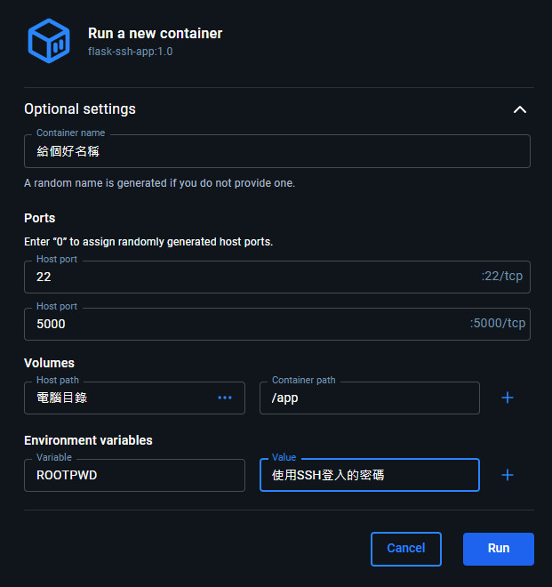

## 使用方式

1. 將entrypoint.sh行尾順序CRLF改成LF

2. 透過以下指令建立docker image

```
docker build -t flask-ssh-app:1.0 .
```

3. 使用Docker Desktop，將此 image 啟動成 container。



4. container "每次" 啟動的時候都會檢查工作目錄下 Flask的基本檔案結構，並自動執行 app.py。 如果沒有基本結構，container 會自動產生給開發者參考。

5. 如果需要增加 python模組，可透過 SSH 以 root身份 登入去調整。
